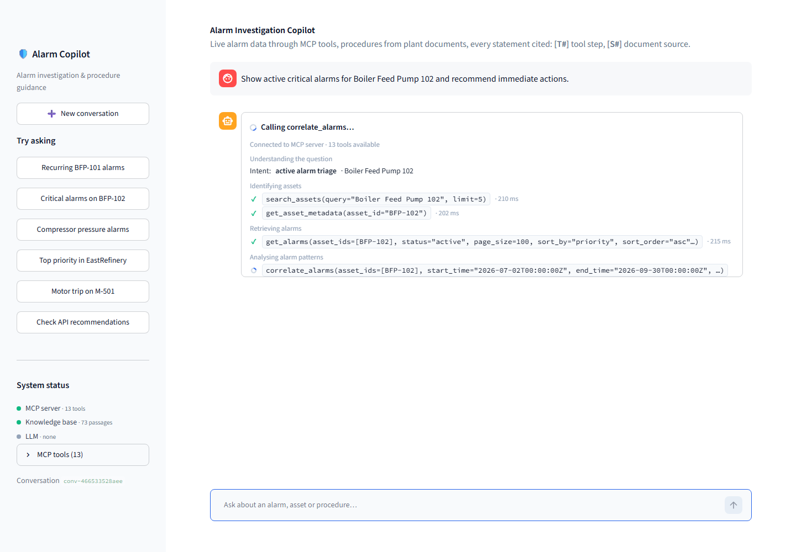
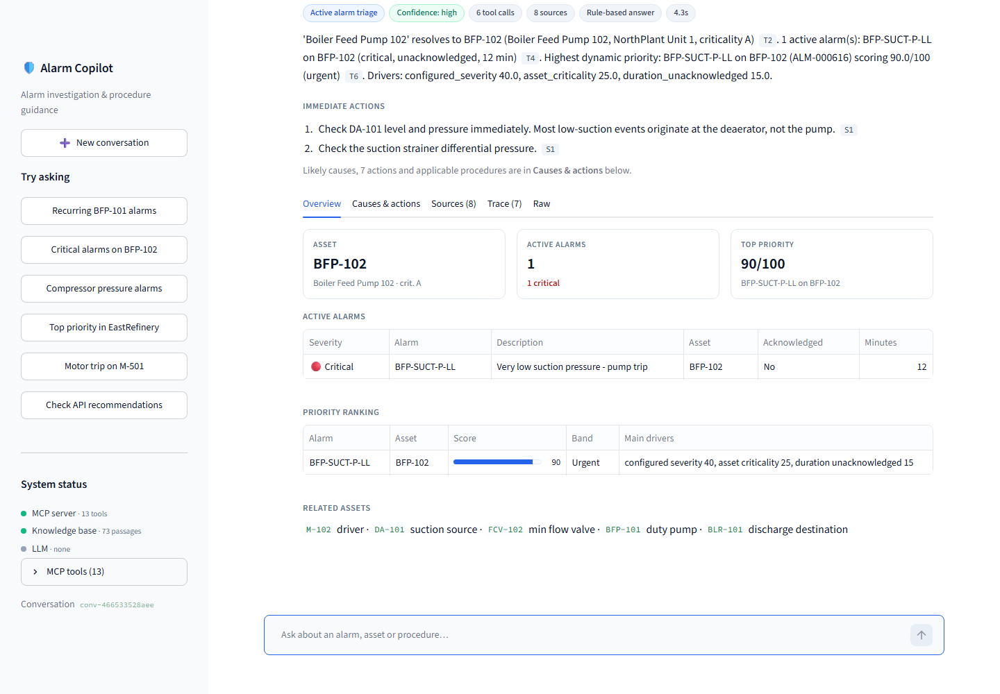
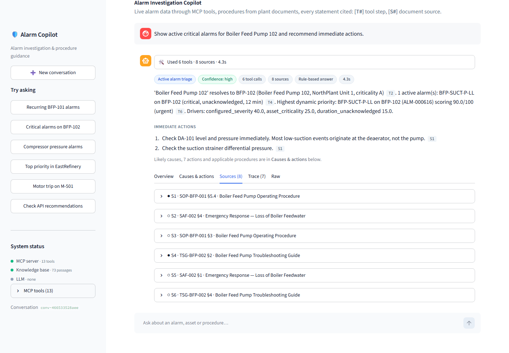
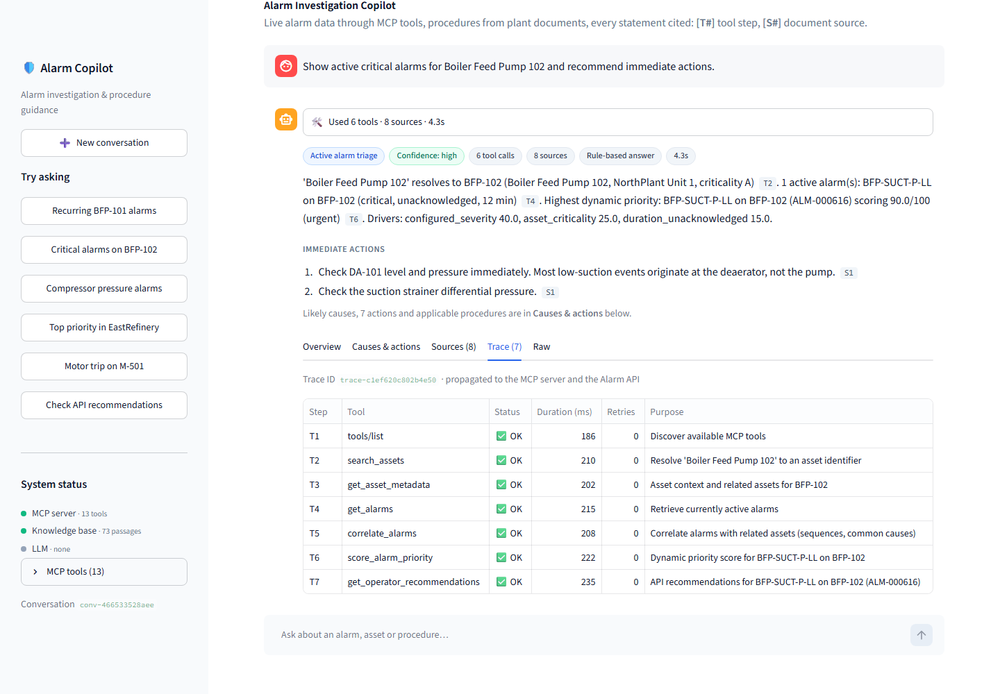

# Alarm Investigation and Procedure Guidance Copilot

An AI copilot for industrial alarm investigation. A **candidate-developed MCP server** exposes the Alarm Management API as typed tools. A **LangGraph** orchestrator discovers and chains those tools through an **MCP client** (`langchain-mcp-adapters`), and retrieves operating, troubleshooting, maintenance and safety procedures through **document RAG** (PostgreSQL + pgvector). It then produces a grounded answer with **source citations and a full MCP execution trace**, shown in a **Streamlit** GUI. The LLM is local **qwen3** via Ollama.

> **Selected use case:** Alarm Investigation and Procedure Guidance Copilot. MCP and RAG run in the **same** workflow for every alarm question.


| | |
|---|---|
| Demo video (≤ 10 min) | _add link after recording; see [docs/demo-script.md](docs/demo-script.md)_ |
| Screenshots | [docs/screenshots/](docs/screenshots/): home, live tool activity, answer, overview, actions, sources, trace |
| Test evidence | [docs/test-evidence.md](docs/test-evidence.md): 138 tests, 92% coverage |
| Example outputs | [test-data/examples/](test-data/examples/): real responses, retrieved chunks, citations |

---

## GUI

| Live tool activity (streamed while answering) | Answer: summary, immediate actions, conflicts |
|---|---|
|  |  |
| **Sources** (cited ● / supporting ○, trust level, excerpt) | **Trace** (every MCP call, request/response, retries) |
|  |  |

The backend streams progress (`POST /api/chat/stream`, NDJSON): workflow stages, intent, and every MCP `tool_start` / `tool_end`. The GUI shows each tool call live, Claude-style, as `tool(args)` → ✓ / ✗ with duration and retries, then keeps a collapsed "Used N tools" log with the answer. The chat shows only the essentials; details live in the **Overview · Causes & actions · Sources · Trace · Raw** tabs. Regenerate the screenshots with `python scripts/capture_screenshots.py`.

## Main capabilities

- **Natural-language requests:**
  - intent detection (10 intents; rules plus LLM, validated);
  - entity extraction: assets, tags, alarm codes, sites, units, severities, look-back window;
  - conversation memory for follow-ups ("which procedure applies to *this* alarm?").
- **MCP tool discovery and multi-step chaining.** Each tool's output feeds the next:
  - `search_assets` → `get_asset_metadata` (related assets);
  - → `get_alarms` (active and history, paginated);
  - → `summarize_alarms` / `get_alarm_trends` / `correlate_alarms` / `find_rationalization_candidates`;
  - → `score_alarm_priority` → `get_operator_recommendations`.
- **Document RAG in the same workflow.** Queries are built from the MCP results (focus alarm code, asset classes, site, the API recommendations to verify) with metadata filters. Retrieval is hybrid: vector, full-text and exact alarm-code matching.
- **Combined reasoning:**
  - likely causes drawn from both alarm correlation and troubleshooting guides;
  - actions drawn from SOPs, safety and maintenance documents;
  - **API recommendations checked against controlled documents**, with unsafe or outdated ones flagged "Do not follow".
- **Evidence and traceability:**
  - every cause and action cites `[T#]` (a tool-trace step) or `[S#]` (a document section);
  - the GUI shows raw MCP requests and responses, upstream API calls, retries and errors.
- **Robustness:**
  - timeouts, retries and error mapping;
  - graceful degradation when a tool, the MCP server, the vector store or the LLM fails;
  - low-confidence retrieval handling;
  - prompt-injection quarantine and an output safety guard.

## Technology stack

| Concern | Technology |
|---|---|
| MCP server | Python `mcp` SDK (FastMCP), streamable HTTP or stdio, pydantic-typed tools |
| MCP client | `langchain-mcp-adapters` (MultiServerMCPClient, tool conversion) + `jsonschema` validation |
| Orchestration | LangGraph (StateGraph, conditional routing, runtime context, checkpointer memory) |
| LLM | Ollama `qwen3:8b` via `langchain-ollama` (JSON mode, thinking disabled). Replaceable, or off (`LLM_PROVIDER=none`) |
| RAG | PostgreSQL 17 + pgvector (HNSW) + full-text (tsvector); Ollama `nomic-embed-text` embeddings |
| Source system | FastAPI Alarm Management API simulator (Postman contract) |
| Backend | FastAPI |
| GUI | Streamlit |
| Quality | pytest (+ pytest-asyncio, pytest-cov), Streamlit AppTest, newman, ruff, mypy, pip-audit, GitHub Actions |
| Packaging | Docker, Docker Compose (health checks, dependency ordering), Makefile |

## Repository structure

```text
.
├── README.md
├── docs/                         architecture.md, architecture-diagram.png, mcp-tool-catalog.md, rag-design.md,
│                                 api-integration.md, design-decisions.md, known-limitations.md, demo-script.md,
│                                 test-evidence.md, coverage/
├── apps/
│   ├── backend/copilot/          FastAPI API + LangGraph workflow, MCP client (mcp_gateway), intent, RAG planning,
│   │                             consistency rules, synthesis, output guard
│   ├── frontend/copilot_ui/      Streamlit GUI
│   └── alarm-api-simulator/      Alarm Management API simulator (the source system)
├── mcp-servers/
│   ├── alarm-management/alarm_mcp/   the MCP server (13 tools)
│   └── optional-secondary-server/    placeholder (see known limitations / future improvements)
├── connectors/alarm_api/         reusable HTTP connector (auth, trace, retry, errors, pagination)
├── rag/
│   ├── ingestion/                load -> chunk -> embed -> pgvector   (python -m rag.ingestion)
│   ├── retrieval/                hybrid retriever (pgvector | in-memory)
│   ├── documents/                sample corpus (SOP, TSG, MM, SAF, philosophy, test fixtures)
│   └── tests/                    ingestion + retrieval tests (incl. live pgvector)
├── shared/                       structured logging, trace context, secret redaction
├── tests/                        unit/ integration/ e2e/  (+ conftest with in-process HTTP servers)
├── test-data/                    postman/ (API contract), examples/ (real outputs)
├── scripts/                      run_local.py, export_examples.py, generate_tool_catalog.py, render_architecture_diagram.py
├── .github/workflows/ci.yml
├── .env.example  .gitignore  Dockerfile  docker-compose.yml  Makefile  LICENSE  pyproject.toml
└── requirements.txt  requirements-dev.txt
```

## Quick start

### Option A: Docker Compose (recommended)

Prerequisites:
- Docker Desktop.
- Ollama on the host, with the two models pulled: `ollama pull qwen3:8b` and `ollama pull nomic-embed-text`.

```bash
cp .env.example .env          # set DB_PASSWORD, ALARM_API_TOKEN, MCP_AUTH_TOKEN
docker compose up --build
```

| Service | URL |
|---|---|
| GUI | http://localhost:8501 |
| Copilot API (OpenAPI) | http://localhost:8080/docs |
| MCP server | http://localhost:9000/mcp (health `/health`) |
| Alarm API simulator | http://localhost:8000/docs |

Variations:
- **No Ollama on the host:** `docker compose --profile ollama up --build`, with `OLLAMA_BASE_URL_DOCKER=http://ollama:11434` in `.env`.
- **Fully offline** (no LLM, no embedding server): set `LLM_PROVIDER=none` and `EMBEDDING_PROVIDER=hash` in `.env`.

### Option B: local Python (Windows / macOS / Linux)

Prerequisites: Python 3.12, PostgreSQL with the pgvector extension, Ollama.

```bash
python -m venv .venv && .venv/Scripts/activate        # Windows (macOS/Linux: source .venv/bin/activate)
pip install -r requirements-dev.txt                    # or: pip install -e ".[dev]"
cp .env.example .env                                   # adjust DB_* and tokens
python -m rag.ingestion                                # build the retrieval index (idempotent)
python scripts/run_local.py                            # starts API simulator, MCP server, backend, GUI
```

Without `make`, set `PYTHONPATH=.;apps/alarm-api-simulator;apps/backend;apps/frontend;mcp-servers/alarm-management` (use `:` on macOS/Linux) before running individual modules. `pip install -e .` also makes all packages importable.

## Running the MCP server independently

```bash
python -m alarm_mcp                         # streamable HTTP: http://127.0.0.1:9000/mcp  (Bearer $MCP_AUTH_TOKEN)
python -m alarm_mcp --transport stdio       # stdio (MCP Inspector, Claude Desktop, ...)
npx @modelcontextprotocol/inspector python -m alarm_mcp --transport stdio
```

It needs `ALARM_API_BASE_URL` and `ALARM_API_TOKEN`, pointing at the simulator (`python -m alarm_api_sim`) or a real API.

### MCP tools

Full input and output schemas, errors, timeouts and examples are in [docs/mcp-tool-catalog.md](docs/mcp-tool-catalog.md).

| Tool | API operation | Purpose |
|---|---|---|
| `search_assets` | `GET /assets/search` | Resolve a name, tag or class to asset ids |
| `get_asset_metadata` | `GET /assets/{id}/metadata` | Criticality, attributes, **related assets** |
| `get_alarms` | `GET /alarms` | Active or historical alarms; filters and pagination (optionally all pages) |
| `get_alarm_details` | `GET /alarms/{id}` | One alarm |
| `summarize_alarms` | `POST /alarms/summary` | KPIs per group (count, recurring rate, ack delay, …) |
| `get_alarm_trends` | `POST /alarms/trends` | Bucketed metrics and trend direction |
| `correlate_alarms` | `POST /alarms/correlation` | Alarm sequences and common-cause assets |
| `analyze_alarm_floods` | `POST /alarms/flood-analysis` | Flood windows and time in flood |
| `find_rationalization_candidates` | `POST /alarms/rationalization-candidates` | Recurring, chattering, stale, no-action alarms |
| `score_alarm_priority` | `POST /alarms/priority-score` | 0–100 dynamic priority with component breakdown |
| `get_operator_recommendations` | `POST /recommendations/operator-actions` | System recommendations, related alarms, history |
| `calculate_alarm_kpi` | `POST /calculation-code/generate` → `/execute` | Flood index, critical density, response efficiency, nuisance score |
| `list_kpi_definitions` | `GET /analytics/kpi-definitions` | KPI formulas and targets |

## RAG corpus and ingestion

- **Corpus:** `rag/documents`, 11 synthetic documents with YAML front matter:
  - 2 SOPs, 2 troubleshooting guides, 2 maintenance manuals, 2 safety documents, 1 alarm philosophy;
  - test fixtures: a superseded revision and an untrusted vendor bulletin containing a prompt injection.
- **Ingestion:**
  - heading-aware section chunks (73);
  - metadata copied onto every chunk (status, doc type, sites, asset classes and ids, alarm codes, trust);
  - alarm codes, tags and cross-references extracted per chunk;
  - injection signals flagged;
  - `nomic-embed-text` embeddings, upserted idempotently into pgvector.
- **Commands:**
  - `python -m rag.ingestion` (`--dry-run`, `--rebuild`, `--prune`);
  - index creation is automatic (`CREATE EXTENSION vector`, tables, HNSW and GIN indexes).
- **Retrieval:** filtered hybrid search with RRF and exact-code boosts, low-confidence detection, citations down to the section.

Details: [docs/rag-design.md](docs/rag-design.md).

## Configuration

Everything comes from environment variables or `.env`; see [.env.example](.env.example). Key settings:

| Variable | Default | Meaning |
|---|---|---|
| `ALARM_API_BASE_URL`, `ALARM_API_TOKEN` | `http://127.0.0.1:8000`, `demo-token` | API used by the **MCP server only** |
| `MCP_SERVER_URL`, `MCP_AUTH_TOKEN` | `http://127.0.0.1:9000/mcp`, `mcp-demo-token` | MCP endpoint and bearer token |
| `DB_HOST/PORT/USER/PASSWORD/NAME` | `127.0.0.1/5432/postgres/-/agent_db` | pgvector database |
| `LLM_PROVIDER`, `OLLAMA_MODEL`, `LLM_TIMEOUT_S` | `ollama`, `qwen3:8b`, `600` | LLM (use `none` to disable) |
| `EMBEDDING_PROVIDER`, `EMBEDDING_MODEL` | `ollama`, `nomic-embed-text` | Embeddings (use `hash` for offline) |
| `RAG_BACKEND`, `RAG_MIN_SIMILARITY` | `pgvector`, `0.62` | Retriever backend and confidence threshold |
| `COPILOT_INTENT_MODE` | `hybrid` | `hybrid` / `llm` / `rules` |
| `COPILOT_REFERENCE_TIME`, `ALARM_SIM_ANCHOR_TIME` | `2026-09-30T00:00:00Z` | "Now" for the copilot and the simulator seed (use `now` for real time) |

## Build, run and test commands

```bash
make install        # pip install -r requirements-dev.txt
make lint           # ruff check + ruff format --check
make typecheck      # mypy
make test           # all tests (pgvector tests skip if no database)
make coverage       # tests + docs/coverage report
make postman        # newman contract run against a running simulator
make ingest | run-api | run-mcp | run-mcp-stdio | run-backend | run-ui | run-all
make up / make down # docker compose
```

The equivalent raw test command is `python -m pytest` (the `pythonpath` is configured in `pyproject.toml`).

## Tests

138 automated tests; see [docs/test-evidence.md](docs/test-evidence.md).

| Suite | What it covers |
|---|---|
| `tests/unit/test_simulator_api.py` | Auth, trace echo, pagination, validation, analytics, fault injection, deterministic seed |
| `tests/unit/test_alarm_api_client.py` | Payload and headers, retries, `Retry-After`, timeouts, error mapping, pagination, path encoding |
| `tests/unit/test_mcp_server_tools.py` | Tool registration and discovery, schemas, annotations, input validation, error mapping, retries, output-contract violations, pagination, trace propagation, KPI chaining |
| `tests/unit/test_mcp_auth_and_observability.py` | MCP bearer auth, log redaction, trace ids in logs |
| `tests/unit/test_intent.py` | Tool selection and intent for all assignment questions, entity extraction, LLM output validation, hybrid mode, follow-up context |
| `tests/unit/test_consistency_guard_synthesis.py` | API-vs-document conflicts, output guard, citation formatting, answer parsing |
| `tests/unit/test_retrieval_plan.py` | Retrieval filtering per intent, injection quarantine, superseded exclusion |
| `rag/tests/*` | Ingestion (loader, chunker, embedder), retrieval relevance, filters, no-result and low-confidence cases, citations, **live pgvector** idempotency and SQL-injection safety |
| `tests/integration/test_mcp_client_integration.py` | Real HTTP MCP server: connectivity, discovery, invocation, invalid arguments, missing tools, partial failure, timeouts, auth failure, unreachable server |
| `tests/integration/test_orchestration.py` | Multi-step chains, outputs passed between tools, RAG in the same workflow, partial source failure, conflicting evidence, MCP down, vector store down, memory, LLM validation and fallback |
| `tests/integration/test_postman_contract.py` | Replays both Postman collections |
| `tests/e2e/test_acceptance_scenario.py` | **Mandatory acceptance scenario** through the backend HTTP API, streaming progress endpoint, prompt-injection safety |
| `tests/e2e/test_gui.py` | Streamlit AppTest: empty, streamed answer and error states; activity log, panels, citations, trace |

## Sample interactions

Real outputs are in [test-data/examples/](test-data/examples/), including a qwen3-generated answer (`*_llm.md`).

| Question | What happens |
|---|---|
| *Investigate recurring high-severity alarms for Boiler Feed Pump 101 over the last 90 days…* | Resolves BFP-101 and pulls 90 days of high/critical history (8× BFP-VIB-HH, increasing trend). Correlation finds DA-101 low level → suction pressure → vibration (cavitation). Cites SOP-BFP-001 §5.2, MM-BFP-003 §6, TSG-BFP-002 §3–4 and SAF-002. Flags the API's "restart the tripped pump" as **Do not follow**. |
| *Show active critical alarms for Boiler Feed Pump 102 and recommend immediate actions.* | Critical BFP-SUCT-P-LL (unacknowledged) and BFP-VIB-HH, with priority scores. Immediate actions from SOP-BFP-001 §5.4 and SAF-002. |
| *Why are compressor discharge pressure alarms repeatedly occurring?* | K-201 and K-202 alarm together after PCV-210 position deviation (downstream restriction), plus many short unacknowledged alarms (a rationalization candidate). Cites TSG-CMP-002. The vendor-bulletin injection is quarantined. |
| *Which alarm has the highest priority in EastRefinery, and why?* | Scores every active alarm: CMP-SURGE on K-202 = 83.3/100 (critical, criticality A, unacknowledged past its 5-minute response time). Cites ALM-PHIL-001 §3–4 and SOP-CMP-001 §3.3. |
| *What related assets should be inspected for the motor trip on M-501?* | Related assets P-501, TR-501 and M-502/M-503. Correlation shows TR-501 voltage dips before simultaneous M-501/M-502 trips; MM-MTR-001 §4 (suspect the common supply). |
| *Which operating procedure applies to this alarm?* (follow-up) | Reuses the previous asset and alarm from conversation memory. |
| *What is the capital of France?* | Out of scope: no alarm tools are called; a scoped refusal. |

## Architecture summary

GUI → FastAPI backend → LangGraph workflow. From there, two paths:

- **MCP path:** the MCP client (`langchain-mcp-adapters`) calls the MCP server over streamable HTTP with a bearer token and trace headers. The server's connector calls the Alarm Management API with its own token.
- **RAG path:** the retrieval service queries pgvector (hybrid search) over documents ingested by the RAG pipeline.

The LLM (qwen3) does intent classification (hybrid) and structured synthesis. Deterministic consistency rules and an output guard keep the answer grounded and safe. JSON logs carry `trace_id` and `conversation_id` across all services, and the same trace id is visible in the simulator's request log.

Details: [docs/architecture.md](docs/architecture.md) · [docs/design-decisions.md](docs/design-decisions.md) · [docs/api-integration.md](docs/api-integration.md).

## Security

- **Secrets:** only from the environment; `SecretStr`; `.env` is gitignored and `.env.example` is provided; logs redact credential-like keys and bearer tokens.
- **Tokens:** separate MCP and API tokens, and the API token exists only inside the MCP server. MCP has a host allow-list (DNS-rebinding protection).
- **Read-only tools:** every tool is read-only (annotated), so no write operation needs approval. Ticket creation is out of scope; if added it would require explicit confirmation.
- **Input validation everywhere:** API bodies (`extra=forbid`), MCP JSON schemas with id patterns, client-side schema validation, and path-segment encoding in the connector.
- **SQL:** bound parameters only, with sanitised `to_tsquery` terms (a test covers SQL-injection strings).
- **Prompt injection:** quarantine, trust labels, prompt contract, deterministic consistency checks, output guard; details in the [RAG design](docs/rag-design.md).
- **KPI "code execution":** built-in implementations only; generated code is display-only.
- **Dependencies:** audited in CI with `pip-audit`.

## Assumptions

- The Postman collections are the full API contract. Response fields they don't specify were designed consistently: `results[]`, `data[]` + `pagination`, `flood_windows[]`, `calculation_id`.
- Documents and plant data are synthetic. Setpoints are illustrative and must not be used on real equipment.
- A single plant operator console and user; no multi-tenant authorisation.
- A local CPU-only LLM is acceptable with longer response times. A GPU or a smaller qwen3 variant gives interactive latency.

## Known limitations

See [docs/known-limitations.md](docs/known-limitations.md). In short:

- CPU LLM latency is about 3–5 minutes per answer with qwen3:8b; the deterministic fallback always works.
- Conversation memory is in-process.
- Auth uses static tokens.
- Injection detection is heuristic, backed by structural defences.
- Correlation is co-occurrence based.
- The demo video and screenshots must be recorded manually.
