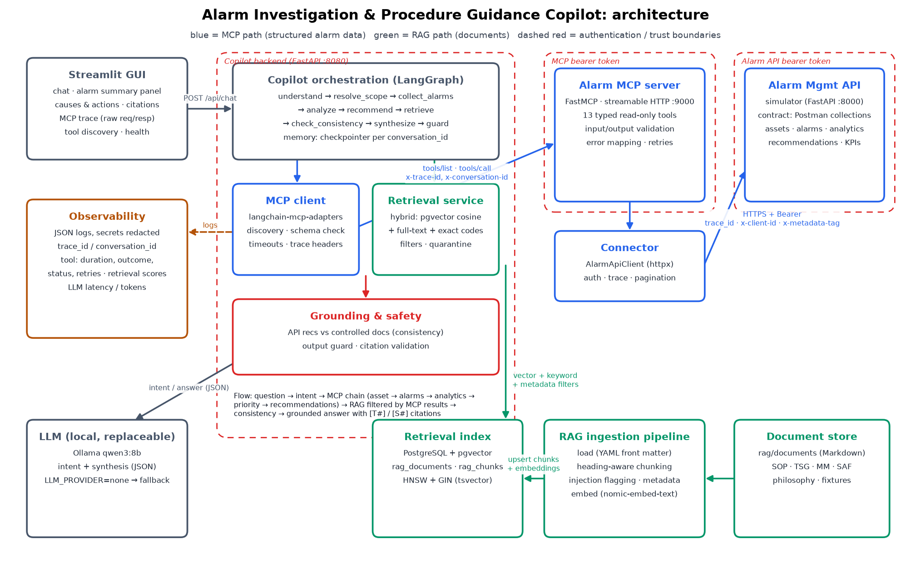
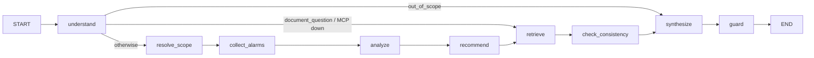

# Architecture



_Regenerate with `python scripts/render_architecture_diagram.py`._

## Components and responsibilities

| Layer | Location | Responsibility |
|---|---|---|
| User interface | `apps/frontend/copilot_ui` (Streamlit) | Chat, alarm summary panel, causes and actions, document citations with trust badges, expandable MCP trace with raw request and response, retries and errors, tool discovery, health. Talks **only** to the backend API. |
| Copilot API | `apps/backend/copilot/api.py` (FastAPI) | `POST /api/chat`, `GET /api/tools`, `GET /health`. Request validation, error envelope. |
| Copilot orchestration | `apps/backend/copilot/graph.py` (LangGraph) | Intent-driven, data-dependent workflow (see below). Per-conversation memory via the LangGraph checkpointer. |
| MCP client / tool registry | `apps/backend/copilot/mcp_gateway.py` | `langchain-mcp-adapters` session over streamable HTTP; tool discovery; JSON-schema validation of arguments before calling; per-call timeout; `ToolCallRecord` trace; never raises on tool failures (partial-failure handling). |
| Candidate-developed MCP server | `mcp-servers/alarm-management/alarm_mcp` (FastMCP) | 13 typed read-only tools, input and output validation, error mapping, trace propagation, bearer auth, stdio or HTTP transport. |
| API connector | `connectors/alarm_api` | Reusable async HTTP client for the Alarm Management API: auth, trace headers, timeout, retry with backoff and `Retry-After`, typed errors, pagination. |
| Source system | `apps/alarm-api-simulator/alarm_api_sim` (FastAPI) | Alarm Management API simulator implementing the Postman contract (15 endpoints), deterministic seed data aligned with the document corpus, fault injection for demos and tests. |
| RAG ingestion | `rag/ingestion` | Load Markdown with YAML front matter, heading-aware chunking, metadata, injection flagging, embeddings, idempotent upsert into pgvector. |
| Retrieval service | `rag/retrieval` | Hybrid retrieval (cosine + full-text + exact alarm-code/asset boosts, RRF fusion), metadata filters, low-confidence detection. Backends: pgvector (prod) and in-memory (tests, offline). |
| Grounding and safety | `apps/backend/copilot/{consistency,guard,synthesis,retrieval_plan}.py` | Query planning per intent, quarantine of injected passages, API-recommendation vs document consistency rules, grounded synthesis, citation validation, unsafe-advice removal. |
| Domain models | `alarm_mcp/models.py`, `copilot/schemas.py`, `rag/*/models.py`, `alarm_api_sim/schemas.py` | Typed contracts at every boundary (pydantic / dataclasses). |
| Configuration | `*/config.py` (pydantic-settings) | Everything from environment / `.env`. Secrets are `SecretStr`. See `.env.example`. |
| Observability | `shared/observability.py` | JSON logs with `trace_id` and `conversation_id` context, secret redaction, events for tool calls (duration, outcome, attempts, retries, HTTP status), retrieval (query, filters, doc ids, scores, low_confidence) and LLM calls (latency, tokens). |
| Persistence | PostgreSQL + pgvector | `rag_documents`, `rag_chunks` (HNSW cosine index, GIN on tsvector and alarm codes). Conversation memory is in-process (see known limitations). |
| LLM | Ollama (`qwen3:8b` default) via `langchain-ollama` | Intent classification (hybrid with rules) and structured JSON answer synthesis. Replaceable (`copilot/llm.py`), optional (`LLM_PROVIDER=none` uses the deterministic composer). |

## Request flow: from prompt to grounded answer

```mermaid
sequenceDiagram
    participant U as Streamlit GUI
    participant B as Copilot API
    participant G as LangGraph workflow
    participant C as MCP client
    participant S as MCP server
    participant A as Alarm API
    participant R as Retrieval (pgvector)
    participant L as LLM (qwen3)
    U->>B: POST /api/chat {message, conversation_id}
    B->>C: connect (Bearer MCP token, x-trace-id, x-conversation-id)
    C->>S: initialize + tools/list (discovery)
    B->>G: ainvoke(state, thread_id=conversation_id)
    G->>G: understand: rules (+ LLM when not decisive) -> intent, entities, time window, follow-up context
    G->>C: search_assets("Boiler Feed Pump 101")
    C->>S: tools/call (schema-validated args)
    S->>A: GET /assets/search (Bearer API token, trace_id, x-metadata-tag)
    A-->>S: results
    S-->>C: structured result + meta (status, attempts, retries)
    G->>C: get_asset_metadata(BFP-101) -> related assets
    G->>C: get_alarms(active) + get_alarms(history, severities, last 90 d, all pages)
    G->>C: summarize_alarms | get_alarm_trends | find_rationalization_candidates | correlate_alarms (parallel)
    G->>C: score_alarm_priority(active alarms)  [triage / priority intents]
    G->>C: get_operator_recommendations(focus alarm)
    G->>R: intent-specific queries filtered by site, asset classes, alarm codes, doc types, status=active
    R-->>G: ranked chunks (+ injection flags, trust levels)
    G->>G: quarantine injected chunks, assign [S#] ids, API recs vs controlled docs (consistency rules)
    G->>L: TOOL FACTS [T#] + DOCUMENT EXCERPTS [S#] + findings -> JSON answer
    L-->>G: summary, causes, actions, procedures, confidence
    G->>G: guard: drop unknown refs, remove unsafe advice, redact; update memory
    B-->>U: ChatResponse (answer, alarm panel, citations, tool trace, warnings, errors)
```

### Workflow graph (LangGraph)



The chain is **data-driven, not hard-coded to the sample questions**:

* `understand` picks the intent (10 intents) and entities. The time window comes from "last N days/weeks/months" or defaults to 90 days. Follow-ups ("this alarm") inherit the asset, alarm code and site from the conversation memory.
* `resolve_scope` turns names, tags or asset classes into asset ids with `search_assets`, then fetches related assets.
* `collect_alarms` selects the **focus alarm** from tool output:
  * an explicit alarm code wins;
  * recurrence questions use the most frequent (or most frequent severe) code;
  * otherwise, the most severe and most recent active alarm.
* `analyze` runs only the analytics that fit the intent, in parallel (summary, trend, correlation, rationalization, KPI, flood). Priority questions score every active alarm and re-focus on the highest score.
* `recommend` asks the API for recommendations on the focus alarm.
* `retrieve` builds RAG queries **from the MCP results**: the focus alarm code and name, the asset classes of resolved assets and their related classes, the site, and the API recommendation texts to verify.

## Boundaries

| Boundary | Mechanism |
|---|---|
| GUI → backend | HTTP JSON only. The GUI never sees MCP or API credentials. |
| Backend → MCP server | Bearer `MCP_AUTH_TOKEN`, host allow-list (DNS-rebinding protection), trace headers. |
| MCP server → Alarm API | Bearer `ALARM_API_TOKEN`, held only by the MCP server. The copilot bypassing MCP is impossible by construction: it has no API token or client. |
| Documents → LLM | Documents are data: wrapped in `<document trust=...>` tags, injected passages quarantined, untrusted sources labelled and ranked last, output guard. |
| LLM → user | Citation validation (only `[T#]` of successful tool calls and `[S#]` of retrieved sources), unsafe-advice removal, consistency findings computed deterministically. |

## Deployment

`docker compose up --build` starts these services:

* `postgres` (pgvector)
* `alarm-api`
* `alarm-mcp`
* `rag-ingest` (one-shot)
* `backend`
* `frontend`

Each has a health check, and the dependency order is:

`postgres → rag-ingest → backend`, and `alarm-api → alarm-mcp → backend → frontend`.

Ollama runs on the host by default; `--profile ollama` runs it in a container instead.
